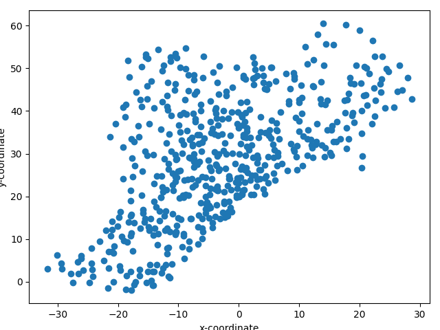

# 1DG3 Data Visualization

*For this task, I've used Python with the Biopython, scikit-learn, and matplotlib libraries.*

## Plotting the Cα coordinates on the plane z=0 

In the first part of the task, I used the Biopython to handle data and matplotlib to plot the graph. 

As shown below, I firstly initialize the MMCIFParser that will be used to parse the file. Once I get the structure, I filtered the data to obtain 1dg3 specific chain data given that 1dg3 have single model and chain.
```parser = MMCIFParser()
structure = parser.get_structure("myFile","1dg3.cif")
chain = structure[0]['A']
```

Later, I create the empty arrays that are going to store the data that used in later to plot graph and perform principal component analysis and apply dimensionality reduction, as shown below

```
x_data = []
y_data = []
pca_input = []
```

As in the loop shown below, I filtered the atoms to Cα atoms only. Then, I get the vector of their coordinates using `get_vector()` Once I get their xyz coordinates, firstly, I append the x coordinates and y coordinates into their respective arrays that will be used to plot the graph of part 1. Secondly, I create a array that include all coordinates and add this array into the 2-dimentional array that is used as an argument for the PCA dimentionaility reduction.

```
for atom in chain.get_atoms():
    if atom.get_name() == 'CA':
        v=atom.get_vector()
        x_data.append(v[0])
        y_data.append(v[1])
        xyz=[v[0],v[1],v[2]]
        pca_input.append(xyz)
```

At last of this part, I used matplotlib to plot a scatter graph for this part of task.

```plt.scatter(x_data,y_data)
plt.tight_layout()
plt.xlabel('x-coordinate')
plt.ylabel('y-coordinate')
plt.show()
```

The graph is shown below:


